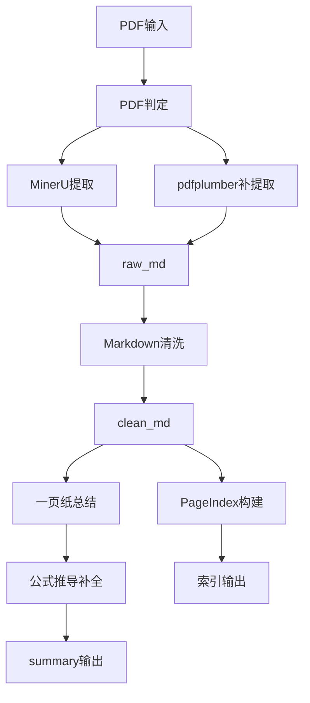
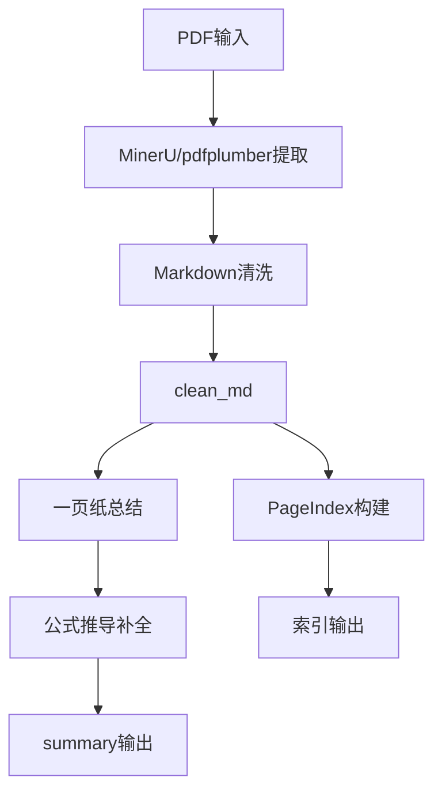
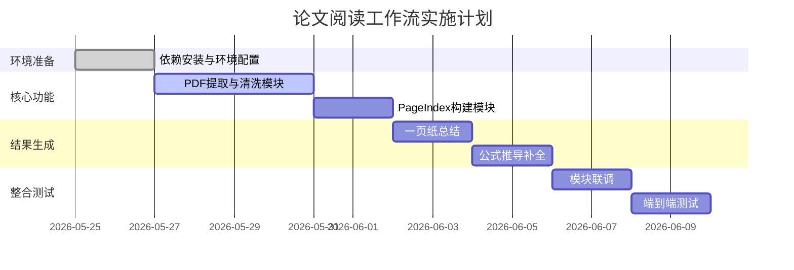

# 论文阅读工作流实施计划（可直接用于AI实施）

## 1. 项目概述

### 1.1 项目背景
本项目面向理工类文献（优先物理论文），目标是把“PDF → 结构化理解结果”流程标准化与自动化，强调可追溯与可复用。

### 1.2 项目目标
- 稳定生成 clean_md、PageIndex 与结构化总结。
- 支持单篇与批量两种模式。
- 支持公式推导补全（按需）。
- 输出内容可追溯到原文段落或公式。

### 1.3 项目价值
- 缩短理解论文的时间。
- 形成可复用的学习资产。
- 把阅读流程从“经验驱动”转为“流程驱动”。

## 2. 输入输出规范

### 2.1 输入规范
- 输入文件：projects/ 目录内的 PDF。
- 输入方式：
  - 单篇：指定文件名。
  - 批量：指定目录。
- 输入验证：
  - 文件存在。
  - PDF 可读。
  - 同名冲突需提示用户选择。

### 2.2 输出规范
- 输出目录：outputs/<pdf_stem>/
- 输出结构（固定）：
  - raw_md/
  - clean_md/
  - pageindex/
  - summary/
  - logs/
- 输出文件建议：
  - summary/one-pager.md
  - summary/section-notes.md
  - summary/formula-notes.md
  - summary/glossary.md
  - summary/followups.md
- 输出原则：所有结论均需附来源线索。

## 3. 数据结构设计

### 3.1 索引结构（JSONL）
- 文件：outputs/<pdf_stem>/pageindex/index.jsonl
- 字段：
  - section_path: 章节路径
  - anchor_id: 段落或公式锚点
  - text: 原文片段
  - source_ref: 页码或定位线索

### 3.2 索引元数据
- 文件：outputs/<pdf_stem>/pageindex/index.meta.json
- 字段建议：
  - sections: 章节树
  - stats: 字符数、段落数、图注数
  - source_map: 页码与章节映射

### 3.3 配置结构
- 文件：config.yaml（或 config.json）
- 字段建议：
  - vision.enabled
  - mineru.path
  - outputs.dir
  - thresholds.clean_md_min_chars

## 4. 模块划分与系统结构

### 4.1 模块划分
- PDF 判定模块：区分图片型/文本型。
- 提取模块：MinerU 与 pdfplumber。
- 清洗模块：生成 clean_md。
- PageIndex 模块：构建索引与元数据。
- 总结模块：生成一页纸总结。
- 公式补全模块：按需生成推导补全。
- 输出与日志模块：统一输出与失败报告。

### 4.2 系统架构图



### 4.3 模块职责表

| 模块名称 | 主要职责 | 输入 | 输出 | 依赖关系 |
|---|---|---|---|---|
| PDF判定 | 判断图片型/文本型 | PDF | 类型标记 | 无 |
| MinerU提取 | 提取图片型PDF | PDF | raw_md | PDF判定 |
| pdfplumber提取 | 补充文本提取 | PDF | 文本片段 | PDF判定 |
| 清洗模块 | 结构清洗 | raw_md+补充 | clean_md | 提取模块 |
| PageIndex模块 | 构建索引 | clean_md | index.jsonl | 清洗模块 |
| 一页纸总结 | 结构化总结 | clean_md+索引 | one-pager.md | PageIndex |
| 公式补全 | 推导补全 | 公式+上下文 | formula-notes.md | 一页纸总结 |
| 输出与日志 | 写入输出与失败报告 | 全流程 | logs+failure | 全模块 |

## 5. 实现步骤与开发规划

### 阶段1：环境准备
- 安装 Python 3.10+。
- 建立 venv。
- 安装依赖（pdfplumber、pyyaml 可选）。
- 校验 MinerU 可调用。

**里程碑 M1**：环境可运行，MinerU 可调用
- **验证**：运行 `magic-pdf --version` 显示版本号
- **验证**：运行 `python -c "import pdfplumber; print('OK')"` 无报错

---

### 阶段2：基础功能开发（必须完成）

1. run_workflow.py
   - 解析参数（单篇/批量）。
   - 路径校验。
   - **验证**：运行 `python scripts/run_workflow.py --help` 显示帮助信息

2. extract_mineru.py
   - 调用 MinerU，输出 raw_md。
   - **验证**：对测试 PDF 运行后，`outputs/<stem>/raw_md/raw.md` 文件存在且内容非空

3. extract_pdfplumber.py
   - 补充正文与表格。
   - **验证**：对文本型 PDF 运行后，返回的文本片段长度 > 0

4. clean_markdown.py
   - 合并与清洗，生成 clean_md。
   - **验证**：`outputs/<stem>/clean_md/clean.md` 包含章节标题（`#` 开头）

5. build_pageindex.py
   - 生成 index.jsonl 与 index.meta.json。
   - **验证**：`index.jsonl` 每行均为合法 JSON，包含 `section_path` 和 `source_ref` 字段

**里程碑 M2**：单篇 PDF 可完整提取并生成 clean_md 和 PageIndex
- **验证**：运行 `python scripts/run_workflow.py --file projects/02-Imaginary-time-Mpemba-effect.pdf` 成功
- **验证**：`outputs/02-Imaginary-time-Mpemba-effect/` 目录包含 `raw_md/`、`clean_md/`、`pageindex/`

---

### 阶段3：结果生成与整合（必须完成）

- summarize_one_pager.py
  - 调用 academic-researcher 生成 one-pager。
  - **验证**：`outputs/<stem>/summary/one-pager.md` 包含"动机"、"方法"、"结果"、"意义"四个模块

- build_formula_notes.py
  - 按需调用 math-reasoning 生成 formula-notes。
  - **验证**：对公式密集型 PDF 运行后，`formula-notes.md` 包含推导步骤

- write_failure_report.py
  - 记录失败原因与可重试建议。
  - **验证**：模拟失败场景后，`failure.md` 包含错误原因和建议

**里程碑 M3**：完整输出结构可用
- **验证**：`outputs/<stem>/summary/` 包含 `one-pager.md`、`section-notes.md`、`glossary.md`、`followups.md`
- **验证**：`one-pager.md` 每个模块不少于 2 句话

---

### 阶段4：联调与验证

- 单篇流程联调。
  - **验证**：完整流程无报错，所有输出文件生成

- 批量模式联调。
  - **验证**：`python scripts/run_workflow.py --dir projects/` 处理多篇 PDF，每篇独立输出

- 失败场景验证。
  - **验证**：单篇失败时，其他论文继续处理，生成 `outputs/failure-summary.md`

**里程碑 M4**：批量模式稳定可用
- **验证**：批量处理 10 篇 PDF，成功率 ≥ 80%
- **验证**：单篇失败不影响其他论文

---

### 扩展功能（稳定后再做）

- 多模态图片理解增强
- 跨论文对比功能
- 概念图谱生成
- 更智能的批量文献管理
- Web UI 界面

## 6. 辅助说明与注意事项

- PDF 判定应采用轻量规则，避免引入复杂模型。
- clean_md 是唯一后续输入，需保证章节与图注线索完整。
- 公式补全必须标注假设/近似，不确定时必须说明原因。
- 批量模式需保证单篇失败不影响整体。
- 多模态不可用时，必须降级为图注 + 正文推断。

## 7. 推荐技术栈与工具

- 语言：Python 3.10+
- PDF 提取：MinerU、pdfplumber
- Markdown 清洗：自定义脚本
- 索引：PageIndex（JSONL 结构）
- 总结技能：academic-researcher
- 公式推导：math-reasoning
- 日志：logging
- CLI：argparse

## 8. 可视化视图

### 8.1 系统逻辑图


### 8.2 项目时间线


## 9. 测试与验证策略

### 9.1 单元测试
- PDF 判定逻辑。
- Markdown 清洗规则。
- PageIndex 输出字段。

### 9.2 集成测试
- 单篇：从 PDF 到 summary 输出。
- 批量：多篇并行处理，验证失败隔离。

### 9.3 端到端测试
- 文本型 PDF。
- 图片型 PDF。
- 公式密集型 PDF。

## 10. 验收标准

### 10.1 里程碑验收

| 里程碑 | 验收条件 | 状态 |
|--------|----------|------|
| M1 | `magic-pdf --version` 显示版本号 | ⬜ |
| M1 | `python -c "import pdfplumber; print('OK')"` 无报错 | ⬜ |
| M2 | 单篇 PDF 完整提取并生成 clean_md 和 PageIndex | ⬜ |
| M3 | `summary/` 包含 one-pager.md、section-notes.md、glossary.md、followups.md | ⬜ |
| M3 | one-pager.md 每个模块不少于 2 句话 | ⬜ |
| M4 | 批量处理 10 篇 PDF，成功率 ≥ 80% | ⬜ |
| M4 | 单篇失败不影响其他论文 | ⬜ |

### 10.2 功能验收
- [ ] 单篇流程可完整跑通并生成 outputs/<pdf_stem>/。
- [ ] one-pager 四模块齐全，每模块不少于 2 句话。
- [ ] PageIndex 可定位至少 3 个问题的答案片段。
- [ ] 章节级理解笔记覆盖一级标题不少于 80%。
- [ ] 批量模式单篇失败不影响其他论文。

### 10.3 性能验收
- [ ] 单篇处理时间可接受（以手动使用为目标）。
- [ ] 批量处理内存占用稳定。

### 10.4 质量验收
- [ ] 输出结论具备来源线索。
- [ ] 不确定时明确标注。

## 11. 风险评估

### 11.1 技术风险
- MinerU 提取质量不稳定。
  - 应对：pdfplumber 补提取 + 阈值降级。

### 11.2 资源风险
- 多模态能力不可用。
  - 应对：图注 + 正文推断降级。

### 11.3 时间风险
- 功能范围膨胀。
  - 应对：严格遵循最小可用链路。

## 12. 交付物清单

### 12.1 代码文件
- scripts/run_workflow.py
- scripts/extract_mineru.py
- scripts/extract_pdfplumber.py
- scripts/clean_markdown.py
- scripts/build_pageindex.py
- scripts/prepare_summary_input.py（原summarize_one_pager.py，负责数据准备）
- scripts/prepare_formula_input.py（原build_formula_notes.py，负责数据准备）
- scripts/write_failure_report.py

说明：V1采用"脚本准备 + Claude手动调用"模式，脚本负责数据准备，Claude负责调用skill生成总结。

### 12.2 配置文件
- requirements.txt
- config.yaml

### 12.3 文档
- README.md
- 实施计划.md

### 12.4 测试文件
- tests/test_pdf_detect.py
- tests/test_clean_markdown.py
- tests/test_build_pageindex.py

## 13. 项目统计

- 总计划文件：1
- 模块数量：8
- 具体任务：18
- 预估总耗时：12-16 小时
- 建议执行周期：5-7 天

## 14. 下一步建议

1. 审核实施计划并确认范围。
2. 按阶段依次实施与验证。
3. 稳定后再扩展多模态能力或跨论文对比功能。

## 15. 实施计划问题解答汇总

### 15.1 MinerU 调用细节

| 项目 | 说明 |
|---|---|
| Windows 命令 | `magic-pdf -p <input.pdf> -o <output_dir> -m auto` |
| 参数 | `-p` PDF 路径, `-o` 输出目录, `-m` 模式（auto/txt/ocr） |
| mineru.path | 指向 `magic-pdf` 命令（pip 安装后的 CLI） |
| 输出结构 | `output_dir/auto/images/` + `*.md` |
| 当前状态 | 未安装，需执行 `pip install magic-pdf[full]` |

### 15.2 PageIndex 实现方式

决断：自建 JSONL 索引，无现成库，最小可用不过度设计。

示例记录（以16.2节字段规范为准）：

```json
{"section_path": "sec2.1", "anchor_id": "para-2-1-3", "text": "The Hamiltonian is defined as...", "source_ref": "p3#sec2.1"}
```

### 15.3 技能调用方式

决断：V1 采用"脚本准备 + Claude 手动调用"模式。

| 角色 | 职责 |
|------|------|
| 脚本 | 读取 clean_md，提取公式块/上下文，生成结构化输入文件（如 `summary/input-for-claude.md`） |
| Claude | 读取输入文件，手动调用 skill，将结果写入 summary/ |

脚本职责（prepare_summary_input.py / prepare_formula_input.py）：
- 读取 clean_md 和 index.meta.json
- 提取章节结构、公式块、关键上下文
- 生成结构化的输入文件，供 Claude 使用

Claude 职责：
- 读取脚本生成的输入文件
- 根据内容判断是否调用 academic-researcher 或 math-reasoning skill
- 将生成的总结写入 summary/ 目录

交付指引.md 中会包含调用指令，告知 Claude 需要生成哪些文件。

### 15.4 PDF 判定规则阈值

决断：使用 MinerU auto 模式 + 800 字阈值。

| 判定项 | 规则 |
|---|---|
| 图片型/文本型 | MinerU `-m auto` 自动检测 |
| 提取失败阈值 | clean_md < 800 字 → 判定失败 → 降级链路 |
| 手动阈值 | 不需要，MinerU auto 已内置检测 |

### 15.5 Markdown 清洗规则

| 项目 | 规则 |
|---|---|
| 章节标题识别 | `#`/`##`/`###` + 数字开头标题（如 `1. Introduction`） |
| 图注保留 | `Figure X:`、`Fig. X:` 开头段落 |
| 公式块提取 | `$$...$$` 与 `\[...\]` 格式 |
| 引用线索保留 | `[1]`、`(Author, Year)` 格式 |
| 优先级 | MinerU 优先，pdfplumber 补充（表格、坐标等） |

### 15.6 source_ref 格式

决断：采用 `{page}#{section_path}` 格式。

示例：
- `p3#sec2.1`：第 3 页第 2.1 小节
- `p5#fig3`：第 5 页图 3
- `p7#eq5`：第 7 页公式 5
- `p2#abstract`：第 2 页摘要

### 15.7 输出文件范围

决断：V1 全部生成。

| 文件 | 必需性 |
|---|---|
| one-pager.md | 必需 |
| section-notes.md | 必需 |
| glossary.md | 必需 |
| followups.md | 必需 |
| formula-notes.md | 按需（出现跳步或用户要求时生成） |

输出路径：`outputs/<pdf_stem>/summary/`

### 15.8 失败报告位置

决断：分层存放。

| 场景 | 位置 |
|---|---|
| 单篇失败 | `outputs/<pdf_stem>/failure.md` |
| 批量失败汇总 | `outputs/failure-summary.md` |

### 15.9 多模态策略

决断：V1 默认开启视觉能力，采用最简方案。

| 方案 | 实现 |
|------|------|
| 脚本侧 | 在交付指引.md 中列出 `raw_md/images/` 目录下的图片路径 |
| Claude 侧 | 在对话中直接查看图片（Claude Code 支持图片输入） |
| 降级方案 | 无法查看图片时，基于图注 + 正文推断 |

配置项：
- `vision.enabled = true`（默认开启）
- 脚本将图片路径列表写入交付指引.md
- Claude 在调用 skill 时可直接查看图片

降级条件：
- Claude Code 不支持图片输入时
- 图片文件损坏或不存在时
- 降级为”基于图注和正文推断”模式

### 15.10 测试样本

决断：使用已有 10 篇论文。

- 位置：`projects/` 文件夹（以16.8节为准）
- 文本型：02、04、06、10
- 公式密集型：05、07、08
- 图片较多型：01、03、09

## 16. 实施细节补充（第二轮澄清）

### 16.1 MinerU 输出目录映射

| 项目 | 说明 |
|---|---|
| 命令 | `magic-pdf -p projects/xxx.pdf -o outputs/xxx/raw_md/ -m auto` |
| 映射 | 直接输出到 `outputs/<pdf_stem>/raw_md/` |
| 理由 | 避免临时目录清理，目录结构已固定 |

### 16.2 PageIndex 字段规范

决断：统一使用 tech-stack.md 字段。

| 字段 | 说明 | 示例 |
|---|---|---|
| section_path | 章节路径 | sec2.1 |
| anchor_id | 段落/公式锚点 | para-2-1-3, eq5 |
| text | 原文片段 | "The Hamiltonian is..." |
| source_ref | 页码定位线索 | p3#sec2.1 |

说明：此前的 `id/type/title/content/page` 仅为简化示例，以此处为准。

### 16.3 section_path 生成规则

| 标题类型 | section_path |
|---|---|
| 2.1 Method | sec2.1 |
| 3. Experiments | sec3 |
| Abstract | abstract |
| Introduction | introduction |
| Conclusion | conclusion |
| Related Work | related-work |

规则：
- 有编号 → `sec` + 编号
- 无编号 → 标题小写，空格替换为连字符

### 16.4 pdfplumber 触发时机与合并策略

决断：仅在 MinerU 失败或过短时启用。

| 场景 | 行为 |
|---|---|
| MinerU 成功且 clean_md ≥ 800 字 | 不调用 pdfplumber |
| MinerU 失败 | 降级到 pdfplumber |
| MinerU 成功但 clean_md < 800 字 | 用 pdfplumber 补充提取 |

合并策略（详细）：

```python
def extract_with_fallback(pdf_path, output_dir):
    """降级链路主函数"""
    # 场景1: MinerU成功且足够长
    mineru_result = extract_with_mineru(pdf_path, output_dir)
    if mineru_result and len(mineru_result) >= 800:
        return mineru_result

    # 场景2: MinerU失败或过短，用pdfplumber补充
    plumber_result = extract_with_pdfplumber(pdf_path)

    if mineru_result:
        # 合并：MinerU为主，pdfplumber补充表格和缺失段落
        return merge_results(mineru_result, plumber_result)
    else:
        # MinerU完全失败，使用pdfplumber结果
        return plumber_result

def merge_results(mineru_md, plumber_text):
    """合并策略：
    1. 保留 MinerU 的章节结构和图注
    2. 将 pdfplumber 提取的表格插入对应位置
    3. 如果 MinerU 缺失某些段落，从 pdfplumber 补充
    4. 后续由 clean_markdown.py 统一清洗
    """
    # 简单拼接，由清洗模块处理结构
    return mineru_md + "\n\n---\n\n[以下为 pdfplumber 补充提取]\n\n" + plumber_text
```

### 16.5 clean_md 文件命名

| 目录 | 文件名 |
|---|---|
| raw_md/ | raw.md |
| clean_md/ | clean.md |

固定命名，MinerU 输出的主文件为 raw.md，清洗后为 clean.md。

### 16.6 Claude 手动调用交付方式

决断：生成 `交付指引.md` 文件。

脚本完成后在 `outputs/<pdf_stem>/` 生成：

```
# 交给 Claude 的文件清单

## 必读文件
- clean_md/clean.md（清洗后的论文正文）
- pageindex/index.meta.json（章节结构与统计）

## 可选文件
- pageindex/index.jsonl（详细索引，需要精确定位时读取）
- raw_md/images/（图片目录，需多模态分析时查看）

## 执行指令
请基于 clean_md 生成：
1. 一页纸总结（one-pager.md）
2. 章节笔记（section-notes.md）
3. 术语表（glossary.md）
4. 追问清单（followups.md）
5. 公式推导补全（formula-notes.md，按需）
```

### 16.7 多模态图片选择规则

决断：方案 A - 分析所有图片。

- `vision.enabled = true`（默认开启）
- 分析 `raw_md/images/` 目录下的所有图片
- 不做引用过滤，简单直接

### 16.8 测试样本路径

决断：测试用例目录改名为 projects。

路径：

```
D:\paper-reading workflow\projects\
├── 01-Superior-resilience-poisoning-unlearning.pdf
├── 02-Imaginary-time-Mpemba-effect.pdf
├── ...
└── 10-Neural-predictor-quantum-architecture-search.pdf
```

### 16.9 重名冲突策略

决断：追加时间戳，格式 `YYYYMMDD_HHmmss`。

示例：

```
outputs/
├── TensorCircuit/
├── TensorCircuit_20260525_143052/
└── TensorCircuit_20260526_091500/
```

## 17. 实施细节补充（第三轮澄清）

### 17.1 MinerU 输出文件名

决断：MinerU 自动生成主 Markdown 文件名，不固定，脚本需查找。

实际输出结构示例：

```
outputs/xxx/raw_md/
├── auto/                    # 或 ocr/ txt/
│   ├── xxx.md              # 主 Markdown（以 PDF 文件名命名）
│   ├── images/
│   │   ├── image1.png
│   │   └── image2.png
│   └── content_list.json
├── middle.json
└── layout.pdf
```

主 Markdown 文件名 = `<pdf_stem>.md`（不是固定的 raw.md）。

脚本查找逻辑：

```python
def find_main_md(raw_md_dir):
  for method_dir in ["auto", "txt", "ocr"]:
    md_dir = os.path.join(raw_md_dir, method_dir)
    if os.path.exists(md_dir):
      for f in os.listdir(md_dir):
        if f.endswith(".md"):
          return os.path.join(md_dir, f)
  return None
```

clean_md/ 下文件仍固定命名为 `clean.md`（由脚本写入时控制）。

### 17.2 PageIndex anchor_id 生成规则

决断：按以下规则生成。

| 类型 | 格式 | 示例 | 说明 |
|---|---|---|---|
| 段落 | para-<section>-<index> | para-2-1-3 | sec2.1 的第 3 个段落 |
| 公式 | eq<文中编号> | eq5 | 按论文中编号（非出现顺序） |
| 图 | fig<文中编号> | fig3 | 按论文中编号 |
| 表 | table<文中编号> | table1 | 按论文中编号 |

段落锚点详细规则：

```
para-<一级章节>-<二级章节>-<段落序号>
```

示例：
- para-2-1-3 → 第 2 章第 1 节第 3 段
- para-3-0-1 → 第 3 章（无子节）第 1 段
- para-0-0-5 → 无章节结构时第 5 段（如 Abstract）

公式/图/表按文中编号：

- 论文中写 Eq. (5) → eq5
- 论文中写 Figure 3 → fig3
- 论文中写 Table 1 → table1

如果文中无编号，按出现顺序：eq-auto-1, fig-auto-1。

## 18. 实施细节补充（第四轮澄清）

### 18.1 MinerU 输出文件名最终方案

决断：MinerU 自动生成主 Markdown 文件名（`<pdf_stem>.md`），脚本查找后**复制并重命名**为 `raw.md`。

脚本逻辑：

```python
def find_and_copy_main_md(raw_md_dir, target_path):
    """查找MinerU生成的主md文件并复制为raw.md"""
    for method_dir in ["auto", "txt", "ocr"]:
        md_dir = os.path.join(raw_md_dir, method_dir)
        if os.path.exists(md_dir):
            for f in os.listdir(md_dir):
                if f.endswith(".md"):
                    src = os.path.join(md_dir, f)
                    shutil.copy2(src, target_path)
                    return target_path
    return None
```

结果：
- `raw_md/raw.md`（固定命名，由脚本复制重命名）
- `clean_md/clean.md`（固定命名，由脚本写入）

### 18.2 交付指引.md 位置

决断：放在 `outputs/<pdf_stem>/交付指引.md`（根目录下，方便 Claude 直接找到）。

### 18.3 PageIndex 字段规范（更新15.2节）

决断：以16.2节为准，更新15.2节示例。

正确的示例：

```json
{"section_path": "sec2.1", "anchor_id": "para-2-1-3", "text": "The Hamiltonian is defined as...", "source_ref": "p3#sec2.1"}
```

### 18.4 脚本调用方式

决断：采用 import 调用方式。

```python
# run_workflow.py
from extract_mineru import extract_with_mineru
from extract_pdfplumber import extract_with_pdfplumber
from clean_markdown import clean_and_merge
from build_pageindex import build_index
```

优点：简单、易调试、无子进程开销。

### 18.5 config.yaml 完整示例

```yaml
# 论文阅读工作流配置

vision:
  enabled: true  # V1默认开启视觉能力

mineru:
  path: magic-pdf  # MinerU命令路径

outputs:
  dir: outputs/  # 输出根目录

thresholds:
  clean_md_min_chars: 800  # clean_md最少字符数

logging:
  level: INFO  # 日志级别
  format: "%(asctime)s [%(levelname)s] [%(name)s] %(message)s"
```

### 18.6 安装状态

| 组件 | 状态 | 版本 | 备注 |
|------|------|------|------|
| magic-pdf (MinerU) | ✅ 已安装并验证 | 1.3.12 | PEK模式+v5模型，txt模式可用 |
| academic-researcher | ✅ 已安装 | - | Claude Code skill |
| math-reasoning | ✅ 已安装 | - | Claude Code skill |
| PyMuPDF | ✅ 可用 | 1.24.14 | 备用方案 |

**MinerU 配置说明**：
- 版本：magic-pdf 1.3.12（.venv环境）
- 模型：PDF-Extract-Kit-1.0（HuggingFace下载，v5版本）
- 模型目录：`D:\MinerU\models\magic-pdf-1.3.12`
- OCR配置：修改`models_config.yml`将v3改为v5
- 公式识别：✅ 已修复（transformers 4.51.3）
- 测试结果：auto模式成功，16页PDF约5分钟

**关键修复**：
1. OCR模型：修改`models_config.yml`使用v5模型
2. 公式识别：降级transformers到4.51.3
3. SSL问题：需monkey-patch禁用GitHub SSL验证

### 18.7 批量模式处理方式

决断：V1 采用顺序处理。

```python
# 批量处理示例
def batch_process(pdf_files):
    results = []
    for pdf in pdf_files:
        try:
            result = process_single(pdf)
            results.append({"file": pdf, "status": "success", "result": result})
        except Exception as e:
            results.append({"file": pdf, "status": "failed", "error": str(e)})
            continue  # 单篇失败不影响其他
    return results
```

### 18.8 日志格式规范

决断：采用以下格式。

```
2026-05-25 14:30:15 [INFO] [extract_mineru] 开始处理: 08-TensorCircuit.pdf
2026-05-25 14:30:20 [INFO] [extract_mineru] 提取完成，字符数: 15234
2026-05-25 14:30:21 [WARNING] [clean_markdown] 图注缺失: image3.png
2026-05-25 14:30:25 [ERROR] [build_pageindex] 构建失败: 章节识别为空
```

Python logging 配置：

```python
import logging

logging.basicConfig(
    level=logging.INFO,
    format="%(asctime)s [%(levelname)s] [%(name)s] %(message)s",
    handlers=[
        logging.FileHandler("outputs/<stem>/logs/run.log"),
        logging.StreamHandler()
    ]
)
```

### 18.9 CLI 接口设计

决断：采用以下接口。

```bash
# 单篇处理
python scripts/run_workflow.py --file 08-TensorCircuit.pdf

# 批量处理（整个目录）
python scripts/run_workflow.py --dir projects/

# 批量处理（指定多个文件）
python scripts/run_workflow.py --file a.pdf --file b.pdf --file c.pdf

# 可选参数
python scripts/run_workflow.py --file 08-TensorCircuit.pdf --config config.yaml
python scripts/run_workflow.py --file 08-TensorCircuit.pdf --verbose  # 详细日志
```

## 19. 最终决断清单

| 序号 | 问题 | 最终决断 |
|------|------|----------|
| 1 | MinerU输出文件名 | 自动生成 `<stem>.md`，脚本查找后复制为 `raw.md` |
| 2 | 交付指引.md位置 | `outputs/<stem>/交付指引.md` |
| 3 | PageIndex字段 | section_path/anchor_id/text/source_ref（以16.2为准） |
| 4 | 脚本调用方式 | import调用 |
| 5 | config.yaml | 完整示例见18.5 |
| 6 | skill安装状态 | academic-researcher ✅, math-reasoning ✅ |
| 7 | MinerU安装状态 | 安装中 |
| 8 | 批量处理方式 | V1顺序处理 |
| 9 | 日志格式 | 见18.8 |
| 10 | CLI接口 | 见18.9 |
