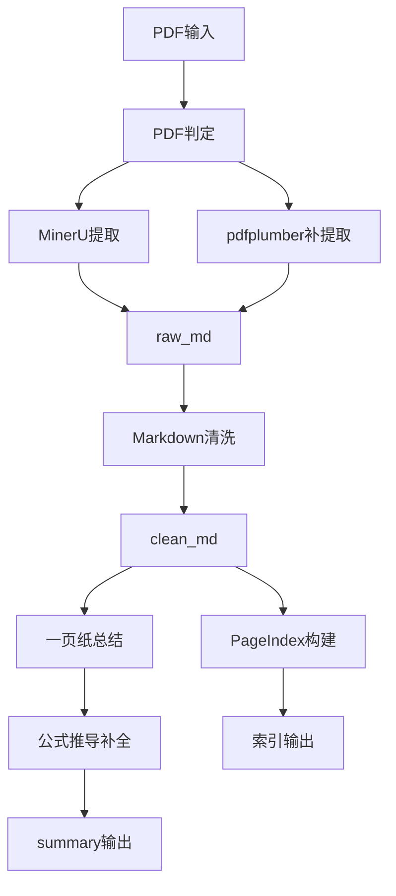
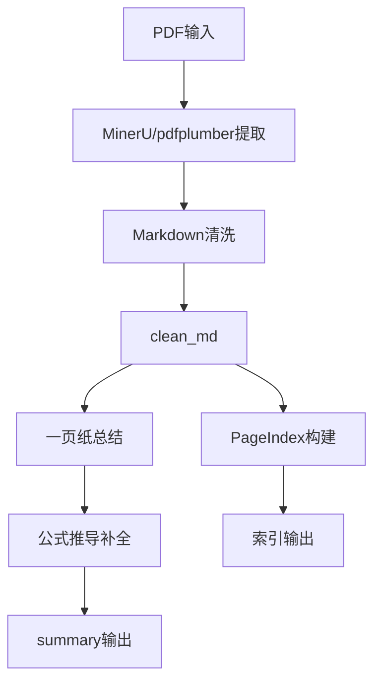
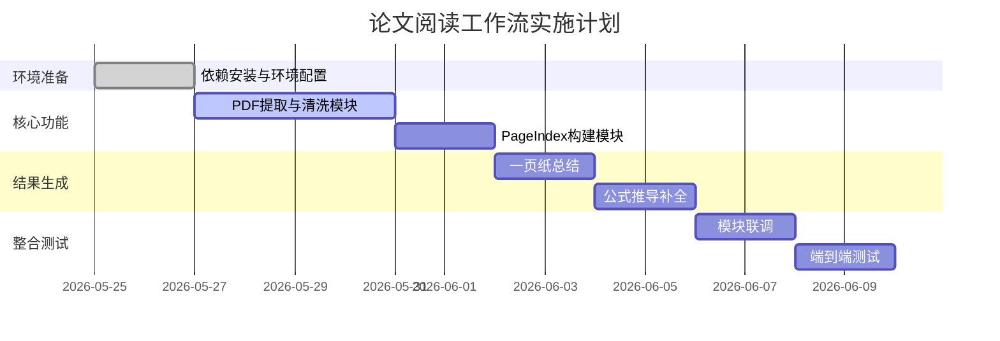

# 论文阅读工作流实施计划（可直接用于AI实施）

## 1. 项目概述

### 1.1 项目背景
本项目面向理工类文献（优先物理论文），目标是把“PDF → 结构化理解结果”流程标准化与自动化，强调可追溯与可复用。

### 1.2 项目目标
- 稳定生成 clean_md、PageIndex 与结构化总结。
- 支持单篇与批量两种模式。
- 支持公式推导补全（按需）。
- 输出内容可追溯到原文段落或公式。

### 1.3 项目价值
- 缩短理解论文的时间。
- 形成可复用的学习资产。
- 把阅读流程从“经验驱动”转为“流程驱动”。

## 2. 输入输出规范

### 2.1 输入规范
- 输入文件：projects/ 目录内的 PDF。
- 输入方式：
  - 单篇：指定文件名。
  - 批量：指定目录。
- 输入验证：
  - 文件存在。
  - PDF 可读。
  - 同名冲突需提示用户选择。

### 2.2 输出规范
- 输出目录：outputs/<pdf_stem>/
- 输出结构（固定）：
  - raw_md/
  - clean_md/
  - pageindex/
  - summary/
  - logs/
- 输出文件建议：
  - summary/one-pager.md
  - summary/section-notes.md
  - summary/formula-notes.md
  - summary/glossary.md
  - summary/followups.md
- 输出原则：所有结论均需附来源线索。

## 3. 数据结构设计

### 3.1 索引结构（JSONL）
- 文件：outputs/<pdf_stem>/pageindex/index.jsonl
- 字段：
  - section_path: 章节路径
  - anchor_id: 段落或公式锚点
  - text: 原文片段
  - source_ref: 页码或定位线索

### 3.2 索引元数据
- 文件：outputs/<pdf_stem>/pageindex/index.meta.json
- 字段建议：
  - sections: 章节树
  - stats: 字符数、段落数、图注数
  - source_map: 页码与章节映射

### 3.3 配置结构
- 文件：config.yaml（或 config.json）
- 字段建议：
  - vision.enabled
  - mineru.path
  - outputs.dir
  - thresholds.clean_md_min_chars

## 4. 模块划分与系统结构

### 4.1 模块划分
- PDF 判定模块：区分图片型/文本型。
- 提取模块：MinerU 与 pdfplumber。
- 清洗模块：生成 clean_md。
- PageIndex 模块：构建索引与元数据。
- 总结模块：生成一页纸总结。
- 公式补全模块：按需生成推导补全。
- 输出与日志模块：统一输出与失败报告。

### 4.2 系统架构图

### 4.3 模块职责表

| 模块名称 | 主要职责 | 输入 | 输出 | 依赖关系 |
|---|---|---|---|---|
| PDF判定 | 判断图片型/文本型 | PDF | 类型标记 | 无 |
| MinerU提取 | 提取图片型PDF | PDF | raw_md | PDF判定 |
| pdfplumber提取 | 补充文本提取 | PDF | 文本片段 | PDF判定 |
| 清洗模块 | 结构清洗 | raw_md+补充 | clean_md | 提取模块 |
| PageIndex模块 | 构建索引 | clean_md | index.jsonl | 清洗模块 |
| 一页纸总结 | 结构化总结 | clean_md+索引 | one-pager.md | PageIndex |
| 公式补全 | 推导补全 | 公式+上下文 | formula-notes.md | 一页纸总结 |
| 输出与日志 | 写入输出与失败报告 | 全流程 | logs+failure | 全模块 |

## 5. 实现步骤与开发规划

### 阶段1：环境准备
- 安装 Python 3.10+。
- 建立 venv。
- 安装依赖（pdfplumber、pyyaml 可选）。
- 校验 MinerU 可调用。

### 阶段2：基础功能开发
1. run_workflow.py
   - 解析参数（单篇/批量）。
   - 路径校验。
2. extract_mineru.py
   - 调用 MinerU，输出 raw_md。
3. extract_pdfplumber.py
   - 补充正文与表格。
4. clean_markdown.py
   - 合并与清洗，生成 clean_md。
5. build_pageindex.py
   - 生成 index.jsonl 与 index.meta.json。

### 阶段3：结果生成与整合
- summarize_one_pager.py
  - 调用 academic-researcher 生成 one-pager。
- build_formula_notes.py
  - 按需调用 math-reasoning 生成 formula-notes。
- write_failure_report.py
  - 记录失败原因与可重试建议。

### 阶段4：联调与验证
- 单篇流程联调。
- 批量模式联调。
- 失败场景验证。

## 6. 辅助说明与注意事项

- PDF 判定应采用轻量规则，避免引入复杂模型。
- clean_md 是唯一后续输入，需保证章节与图注线索完整。
- 公式补全必须标注假设/近似，不确定时必须说明原因。
- 批量模式需保证单篇失败不影响整体。
- 多模态不可用时，必须降级为图注 + 正文推断。

## 7. 推荐技术栈与工具

- 语言：Python 3.10+
- PDF 提取：MinerU、pdfplumber
- Markdown 清洗：自定义脚本
- 索引：PageIndex（JSONL 结构）
- 总结技能：academic-researcher
- 公式推导：math-reasoning
- 日志：logging
- CLI：argparse

## 8. 可视化视图

### 8.1 系统逻辑图

### 8.2 项目时间线

## 9. 测试与验证策略

### 9.1 单元测试
- PDF 判定逻辑。
- Markdown 清洗规则。
- PageIndex 输出字段。

### 9.2 集成测试
- 单篇：从 PDF 到 summary 输出。
- 批量：多篇并行处理，验证失败隔离。

### 9.3 端到端测试
- 文本型 PDF。
- 图片型 PDF。
- 公式密集型 PDF。

## 10. 验收标准

### 10.1 功能验收
- [ ] 单篇流程可完整跑通并生成 outputs/<pdf_stem>/。
- [ ] one-pager 四模块齐全，每模块不少于 2 句话。
- [ ] PageIndex 可定位至少 3 个问题的答案片段。
- [ ] 章节级理解笔记覆盖一级标题不少于 80%。
- [ ] 批量模式单篇失败不影响其他论文。

### 10.2 性能验收
- [ ] 单篇处理时间可接受（以手动使用为目标）。
- [ ] 批量处理内存占用稳定。

### 10.3 质量验收
- [ ] 输出结论具备来源线索。
- [ ] 不确定时明确标注。

## 11. 风险评估

### 11.1 技术风险
- MinerU 提取质量不稳定。
  - 应对：pdfplumber 补提取 + 阈值降级。

### 11.2 资源风险
- 多模态能力不可用。
  - 应对：图注 + 正文推断降级。

### 11.3 时间风险
- 功能范围膨胀。
  - 应对：严格遵循最小可用链路。

## 12. 交付物清单

### 12.1 代码文件
- scripts/run_workflow.py
- scripts/extract_mineru.py
- scripts/extract_pdfplumber.py
- scripts/clean_markdown.py
- scripts/build_pageindex.py
- scripts/summarize_one_pager.py
- scripts/build_formula_notes.py
- scripts/write_failure_report.py

### 12.2 配置文件
- requirements.txt
- config.yaml

### 12.3 文档
- README.md
- 实施计划.md

### 12.4 测试文件
- tests/test_pdf_detect.py
- tests/test_clean_markdown.py
- tests/test_build_pageindex.py

## 13. 项目统计

- 总计划文件：1
- 模块数量：8
- 具体任务：18
- 预估总耗时：12-16 小时
- 建议执行周期：5-7 天

## 14. 下一步建议

1. 审核实施计划并确认范围。
2. 按阶段依次实施与验证。
3. 稳定后再扩展多模态能力或跨论文对比功能。
